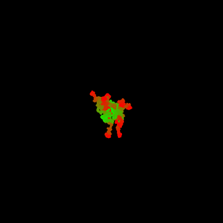

# THREE D WALK

A branching 3D tree like a folded protein. Class-based so that each branch is responsible for its own individual elements and can be moved in three dimensinal space.

## Notes

Running this sketch will save a frame per tick in the output folder. This will effect performance but allows for the creation of a video via the movie maker.

